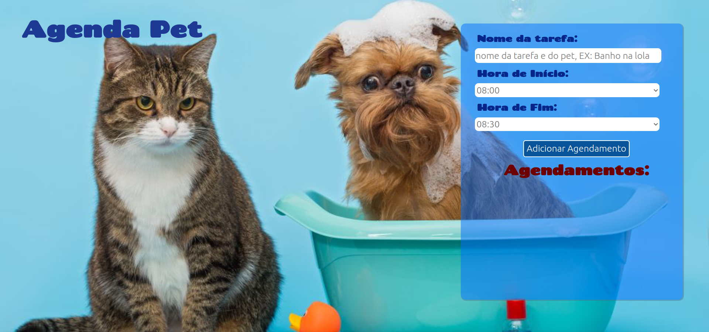
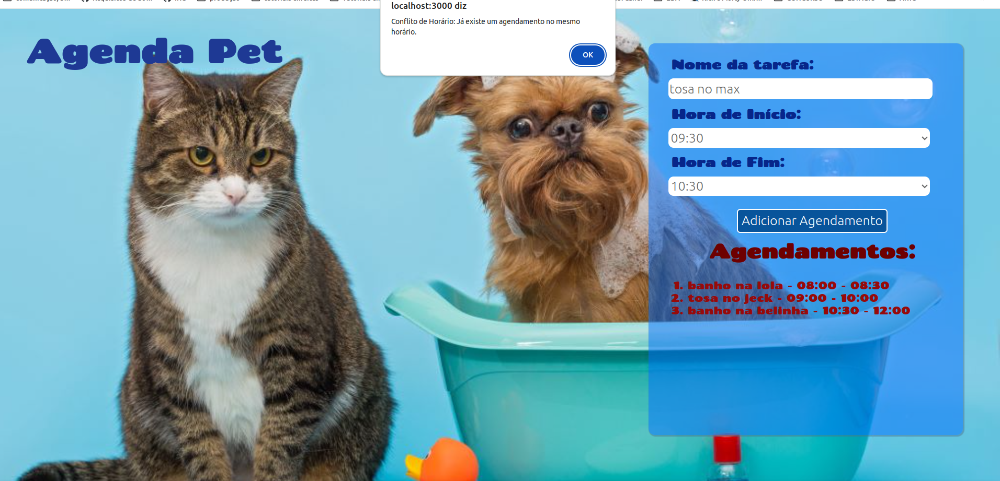

# Agenda Pet

**Conteúdo da Disciplina**: Greed<br>

## Alunos
|Matrícula | Aluno |
| -- | -- |
| 20/0018442  |  Gabrielly Assunção Rodrigues |
| 20/0023934|  Maria Eduarda Barbosa Santos |

### Apresentação

## Sobre
Para os profissionais que dedicam seus dias cuidando de animais de estimação em pet shops, a gestão eficaz das múltiplas tarefas ligadas aos bichinhos é absolutamente crucial, principalmente para os microempreendedores, como a Joana, que abriu uma pequena empresa. O pet shop dela não tem funcionários, havendo a necessidade de agendar as tarefas do dia de forma que não sejam no mesmo horário, pois é só ela que faz as tarefas. Nesse contexto da Joana, o **Agenda Pet** se destaca como uma ferramenta especialmente desenvolvida para suprir essa necessidade de microempreendedores individuais. Ele oferece a capacidade de obter o máximo de tarefas que podem ser realizadas no dia, resultando em máxima produtividade e consequentemente um aumento nos ganhos financeiros. Com o Agenda Pet, o cuidado e a eficiência caminham de mãos dadas, proporcionando benefícios tanto para os profissionais quanto para os queridos animais sob seus cuidados.


## Screenshots

A **Imagem 1** ilustra a funcionalidade do Agenda Pet. Existe situações em que uma tarefa não é compatível com as outras, quando essa incompatibilidade ocorre, um aviso é exibido, impedindo o agendamento da tarefa, conforme evidenciado na **Imagem 3**. Na **Imagem 2** apresenta o resultado final, maximizando o número de atividades agendadas em um dia, sem a ocorrência de conflitos de horário.

**Imagem 1** 


**Imagem 2**


**Imagem 3**


## Instalação 
**Linguagem**: JavaScript<br>
**Framework**: Node.js React.js<br>
### Pré-requisitos para rodar o sistema:

- Node.js versão v14.0.0 ou superior <br>
- npm (nesse caso o comando no terminal é: ```npm install``` e terá que ser dentro da pasta petshop)

#### Passo 1

- Após a instalação de todos os pŕe-requisitos, dentro da pasta petshop utilize o comando:
  ```
  npm start
### Pronto, o projeto estará rodando!

## Uso 
O Agenda Pet vai receber o nome das tarefas e seus horários de início e fim inseridas por você. Vale ressaltar que essas tarefas são as planejadas para serem realizadas no dia. Após adicionar elas, clique em 'Concluir' e você receberá o resultado do máximo de tarefas que serão possíveis de serem realizadas durante o dia na sequencia certa, da primeira a ser realizada até a última, sem que uma tenha horário conflitante com a outra. 

## Outros 

As tarefas são inseridas no seguinte formato, onde você especifica o nome do pet, como exemplificado a seguir: `Tosa no Duke`.